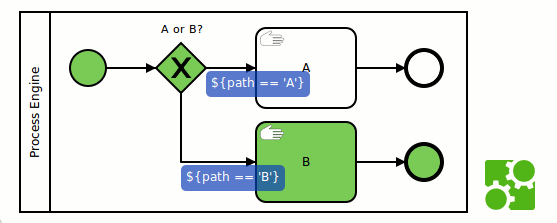

# Camunda Process Test Coverage

## Introduction
This library supports visualizing and asserting the process test coverage of a BPMN process.



Running your process unit tests with the library creates test coverage reports for:

* Entire test suites: The process coverage is visualized by marking those tasks and events with a green color which have been traversed by any of the test suite's test cases.

It also supports coverage ratio checks for sequence flows and flow nodes in the JUnit tests.
```
java.lang.AssertionError: 
Expected: matches if the coverage ratio is at least <1.0>
     got: <0.9516129032258065>
```
* Check coverage after running a single test case: supported via JUnit @Rule or manual calls  
* Check coverage after running a test class: support via JUnit @ClassRule or manual calls
* Other setups:  manual calls

Using properties you can set expected coverage at build time of your project.


## Getting Started

Add this Maven Dependency to your project:

```
<dependency>
  <groupId>org.camunda.bpm.extension</groupId>
  <artifactId>camunda-bpm-process-test-coverage</artifactId>
  <version>0.2.6-SNAPSHOT</version>
  <scope>test</scope>
</dependency>
```

Have a look at this project's tests. E.g.
- Class rule usage: [ProcessTestClassRuleCoverageTest](src/test/java/org/camunda/bpm/extension/process_test_coverage/ProcessTestClassRuleCoverageTest.java):
- Method rule usage: [ProcessTestMethodRuleCoverageTest](src/test/java/org/camunda/bpm/extension/process_test_coverage/ProcessTestMethodRuleCoverageTest.java):
- Manual usage: [ProcessTestNoRulesCoverageTest](src/test/java/org/camunda/bpm/extension/process_test_coverage/ProcessTestNoRulesCoverageTest.java):
- Test checking property usage: [ProcessTestClassRulePropertyTest](src/test/java/org/camunda/bpm/extension/process_test_coverage/ProcessTestClassRulePropertyTest.java):

### Checking Coverage for the Examples
You can use the JUnit tests of this project to get comfortable with the library

1. clone the project
2. mvn clean test
3. Open the report html files which are created in the directory target/process-test-coverage/

### Checking Coverage for Your Own Processes
The following steps show how to integrate the camunda-process-test-coverage into you own setup. Our tests should provide a good base for your usage. If you use a single JUnit class per process, the class rule usage may be the perfect way to go.

1.   add library jar to your project classpath (e.g. via the maven dependency)
2.   add the [TraceActivitiesHistoryEventHandler](src/main/java/org/camunda/bpm/extension/process_test_coverage/trace/TraceActivitiesHistoryEventHandler.java) as history handler to your test camunda setup (see the [camunda.cfg.xml](src/test/resources/camunda.cfg.xml) we use)
2.   add the [PathCoverageParseListenerPlugin](src/main/java/org/camunda/bpm/extension/process_test_coverage/trace/PathCoverageParseListenerPlugin.java) as process engine plug-in to your test camunda setup (see the [camunda.cfg.xml](src/test/resources/camunda.cfg.xml) we use)
3.   adapt your process unit test to generate and check the coverage. You can set the Java system property ' 
4.   run your unit tests

## Environment Restrictions
* Built against Camunda BPM version 7.2.0 and Java 1.6
* Tested against Camunda BPM version 7.2.0 and Java 1.6 
* Tested against Camunda BPM version 7.4.0 and Java 1.8  
* Expected to work in Camunda BPM 7.x versions starting from 7.2.0 (7.2.x, 7.3.x, 7.4.x, 7.5.x).

## Known Limitations
* Sequence flows are not visually marked. Coverage percentage of sequence flows can be asserted though.
<<<<<<< HEAD
* Reports for an individual test method can only contain one process
* Test cases that deploy different versions of the same process (same process definition key) are not officially supported and may result in misleading reports. Make sure all your processes have unique process definition keys (in BPMN XML //process@id).
=======
* Test cases that deploy different versions of the same process (same process definition key) are not officially supported and may result in misleading reports. Make sure all your processes have unique process definition keys (in BPMN XML //process@id).
* The listener visualization seems works in some browsers (i.e. chrome) at the moment
>>>>>>> refs/heads/develop

## Resources
* [Issue Tracker](https://github.com/camunda/camunda-process-test-coverage/issues)
* [Roadmap](#roadmap)
* [Changelog](https://github.com/camunda/camunda-process-test-coverage/commits/master)
* [Contributing](CONTRIBUTING.md)
* [Implementation Notes](IMPLEMENTATION.md)

## Roadmap

Our To Do list gives a rough idea what we expect to tackle next.

**To Do**
- 0.2.7 Visualize single test method runs
- 0.2.8 Visualize covered sequence flow
- 0.2.9 Text reports of traces
- 0.3.x Remove the history handler, use the plug-in to place listeners on flow nodes
- 0.4.x Text reports of traces as alternate way to check coverage
- Visualize technical attributes in a nice way

**Done**
- 0.2.6 "Jenkins integration" - add minimal coverage system property for build integration
- 0.2.5 fixed different multi-deployment cases
- JUnit @Rule, JUnit @ClassRule
- Calculate Flow Node Coverage in percent
- Calculate Path Coverage in percent
- Visualize test coverage using [bpmn.io](http://bpmn.io)
- Visualize transaction boundaries
- Visualize technical attributes

## Contributors
The Software Development Team of [WDW eLab GmbH](http://www.wdw-elab.de) is responsible for the Design and Implementation of this project.


WDW eLab GmbH is an innovative IT company and has great experience with complex business support processes in a complex IT environment. One of our specialties are customer support processes in telecommunication. 

We are proud to be an official camunda partner!

Feel free to contact us via [Email](mailto:kontakt@wdw-elab.de)

## Maintainer

People responsible for this project

[Irmin Okic (wdw-elab)](https://github.com/z0rbas)

[Axel Groß (wdw-elab)](https://github.com/phax1)

[Falko Menge (Camunda)](https://github.com/falko)

## License
[Apache License, Version 2.0](http://www.apache.org/licenses/LICENSE-2.0). See [LICENSE](LICENSE) file.


