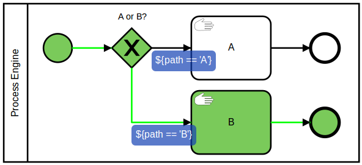

# Camunda Process Test Coverage

## Introduction
This tool supports in analyzing and visualizing the process test coverage of a BPMN process.



The tool creates test coverage reports for:

* Single test cases: The process coverage is visualized by marking those tasks and events with a green color which have be traversed by the test case.
* Entire test suites: The process coverage is visualized by marking those tasks and events with a green color which have be traversed by any of the test suite's test cases.

## Get started

Add this Maven Dependency to your project:

```
<dependency>
  <groupId>org.camunda.bpm.extension</groupId>
  <artifactId>camunda-process-test-coverage</artifactId>
  <version>0.2.4-SNAPSHOT</version>
  <scope>test</scope>
</dependency>
```

Have a look at the [ProcessTestCoverageTest](src/test/java/org/camunda/bpm/consulting/process_test_coverage/ProcessTestCoverageTest.java):

- In a tearDown() or @AfterClass method for the Test Class coverage
```java
  @After
  public void calculateCoverage() throws Exception {
    // calculate coverage for all tests
    ProcessTestCoverage.calculate(processEngineRule.getProcessEngine());
  }  
```

- In the actual test methods to get coverage for test cases
```java
ProcessTestCoverage.calculate(processInstance, processEngineRule.getProcessEngine());
```

## Remarks to run this application
1. mvn clean test
2. Open html files which are created in the directory target/process-test-coverage/

## Known Limitations
Test cases that deploy different version of the same process (same process definition key) are currently not supported and will result in miss-leading reports. Just make sure all your processes have unique process definition keys (in BPMN XML //process@id).

## Resources

* [Issue Tracker](https://github.com/camunda/camunda-process-test-coverage/issues)
* [Roadmap](#Roadmap)
* [Changelog](https://github.com/camunda/camunda-process-test-coverage/commits/master)
* [Contributing](CONTRIBUTE.md)


## Roadmap

**todo**

- JUnit Rule
- Calculate Flow Node Coverage in percent
- Calculate Path Coverage in percent
- Visualize technical attributes

**done**

- Visualize test coverage using [bpmn.io](http://bpmn.io)
- Visualize transaction boundaries


## Maintainer

[Falko Menge (Camunda)](https://github.com/falko)

## License

Apache License, Version 2.0
