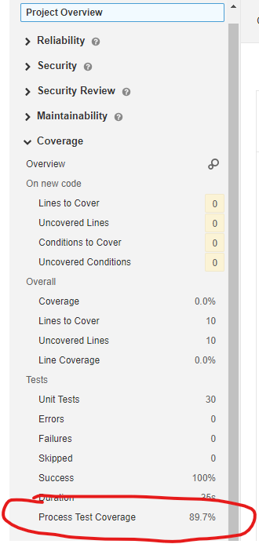

## Sonarqube plugin

A plugin for sonarqube is provided with the artifact

```xml
<dependency>
  <groupId>org.camunda.community.process_test_coverage</groupId>
  <artifactId>sonar-camunda-process-test-coverage-plugin</artifactId>
  <version>${camunda-process-test-coverage.version}</version>
</dependency>
```

To install this plugin into Sonarqube please have a look at:
https://docs.sonarsource.com/sonarqube/latest/setup-and-upgrade/install-a-plugin/
Currently we don't provide the plugin via the marketplace, so it has to be manually installed.

The plugin can be configured via sonar.process-test-coverage.jsonReportPaths property.
This can be used to define comma separated glob patterns to find the json report files of the coverage calculation.

The plugin adds a coverage measure for each found BPMN diagram and also an accumulated one on project level.




Also a HTML for the project is added as a project report page.


